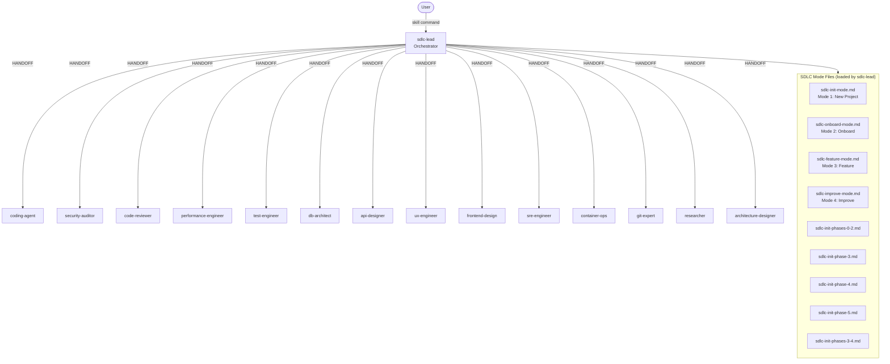

[🏠 Index](README.md)  |  [← Tool System](04-tools.md)  |  [SDLC Workflow →](06-sdlc-workflow.md)

---

# 5. Agent System

### 5.1 Agent Catalog

| Agent | Skill | Domain | Mode |
|-------|-------|--------|------|
| `sdlc-lead` | `/sdlc` | Orchestrator — routes, tracks, delegates | primary |
| `coding-agent` | `/code` | Doc-driven implementation, anti-slop rules | primary |
| `security-auditor` | `/security` | OWASP, threat modeling, CVE, Semgrep | primary |
| `code-reviewer` | `/review-code` | Code health, complexity, duplication, tech debt | primary |
| `performance-engineer` | `/perf` | Profiling, benchmarks, bottleneck diagnosis | primary |
| `test-engineer` | `/test-expert` | Playwright, vitest, test strategy, coverage | primary |
| `db-architect` | `/dba` | Schema design, migrations, query optimization | primary |
| `api-designer` | `/api-design` | REST/GraphQL contracts, OpenAPI | primary |
| `ux-engineer` | `/ux` | UX workflows, WCAG, component architecture | primary |
| `frontend-design` | `/frontend` | Visual implementation, typography, design systems | primary |
| `sre-engineer` | `/devops` | CI/CD, runbooks, monitoring, deployment | primary |
| `container-ops` | `/containers` | Podman/Docker, compose, image debugging | primary |
| `git-expert` | `/git-expert` | Branching, commits, releases, forensics | primary |
| `researcher` | `/research` | Web research, tech comparisons, feasibility | primary |
| `architecture-designer` | `/arch` | Module structure, plugin points, infra topology | primary |

### 5.2 Shared Protocol Files

| File | Purpose |
|------|---------|
| `HANDOFF_TEMPLATES.md` | Canonical HANDOFF block format (4 templates) |
| `LOOP_PREVENTION.md` | Hard caps on tool loops (3 classes: failure, schema, success) |
| `BOUNDED_TASK_CONTRACT.md` | 6 rules governing every HANDOFF specialist |
| `SCOPE_BOUNDARY.md` | Stay-in-lane rules — which agent does what |
| `FIX_VERIFY_LOOP.md` | Protocol for fix → verify → confirm cycles |
| `RALPH_WIGGUM_LOOP.md` | Deep-mode exhaustive inventory loop |
| `ANTI_SLOP_RULES.md` | Anti-overengineering rules for coding-agent |
| `RESEARCH_TOOLS.md` | Web research tool usage guide |
| `CONTEXT_BUDGET.md` | Context window management for small LLMs |
| `LOCAL_LLM_PRIMER.md` | Tips for local LLM quirks (Qwen, Gemma, etc.) |
| `MODEL_ADAPTER.md` | Per-model behavior adaptations |
| `SESSION_PRIMER.md` | Session startup checklist |
| `HANDOFF_QUICK_REF.md` | Quick reference for HANDOFF format |

### 5.3 Agent Hierarchy

---

---

[🏠 Index](README.md)  |  [← Tool System](04-tools.md)  |  [SDLC Workflow →](06-sdlc-workflow.md)
