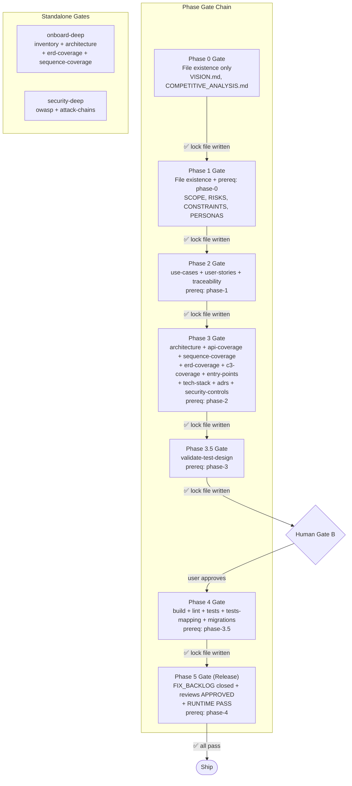
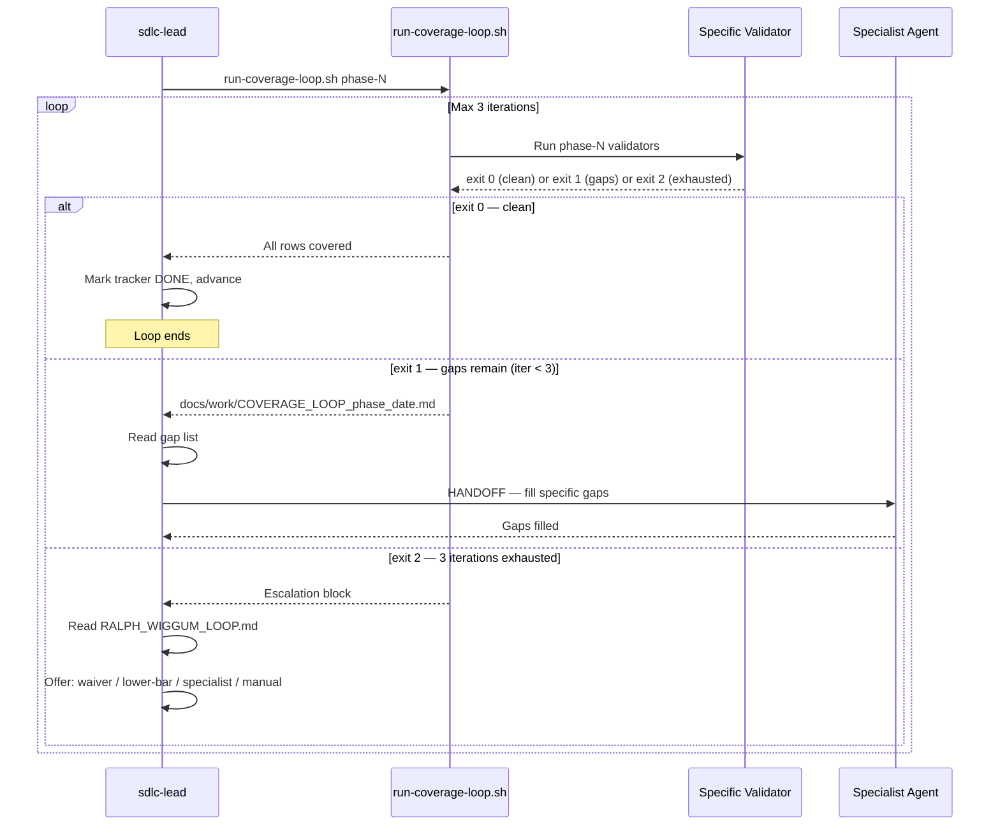

[🏠 Index](README.md)  |  [← HANDOFF Delegation Protocol](07-handoff-protocol.md)  |  [Installation Flow →](09-installation.md)

---

# 8. Validation Gate System

### 8.1 Phase Gate Structure

### 8.2 Coverage Loop Protocol

---

---

[🏠 Index](README.md)  |  [← HANDOFF Delegation Protocol](07-handoff-protocol.md)  |  [Installation Flow →](09-installation.md)
