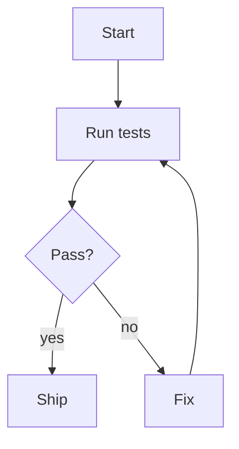
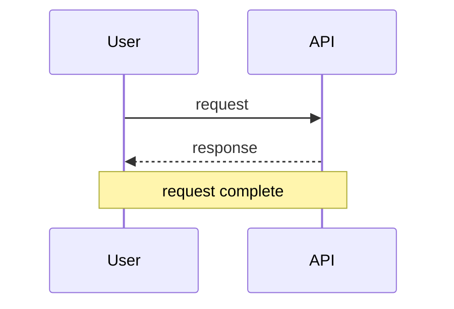

# Diagram

Two clean, valid Mermaid diagrams -- no unsafe characters, balanced
brackets, closed fences. Must render cleanly under a real `mmdc` install
(not just pass the static checks).

```mermaid
flowchart TD
  A["Start"] --> B["Run tests"]
  B --> C{"Pass?"}
  C -->|"yes"| D["Ship"]
  C -->|"no"| E["Fix"]
  E --> B
```

```mermaid
sequenceDiagram
  participant User
  participant API
  User->>API: request
  API-->>User: response
  Note over User,API: request complete
```
