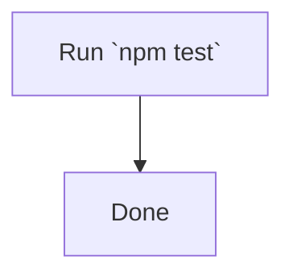

# Diagram

Historical bug class (T29.9): an unescaped backtick inside a Mermaid node
label breaks the parser, and the publish pipeline silently falls back to
showing the raw ```mermaid code block instead of the rendered diagram.


